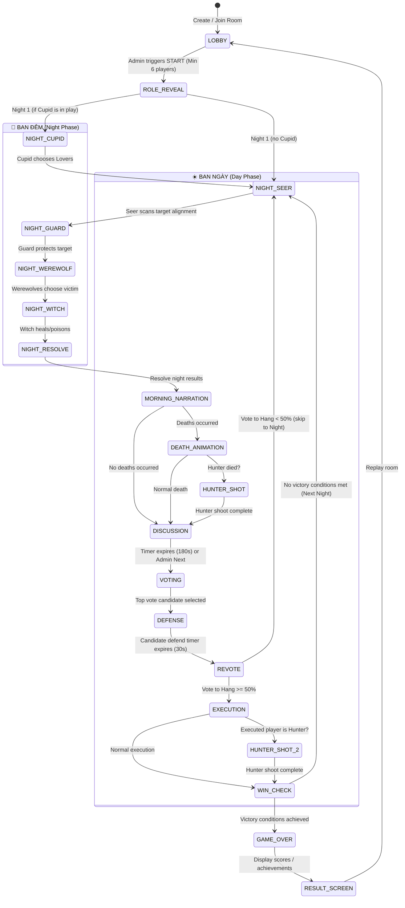

# Product Contract: Gameplay Mechanics

This document details the complete Game State Machine, role descriptions, game flow logic, and distribution ratios.

---

## 🎮 Game State Machine

The game is controlled by the backend state coordinator and executes the following sequence:

---

## 🎭 The 10 Game Roles

| Role | Faction | Nocturnal? | Night Order | Night Action / Ability | Win Condition |
|---|---|---|---|---|---|
| **🐺 Werewolf (Sói)** | Werewolves | ✅ | 3 | Mutually agree to eliminate 1 player per night. | Werewolves >= Villagers |
| **🔮 Seer (Tiên Tri)** | Villagers | ✅ | 1 | Reveal alignment of 1 player (Werewolf or Non-Werewolf). | Eliminate all Werewolves |
| **🧙 Witch (Phù Thủy)** | Villagers | ✅ | 4 | 1 healing potion + 1 poison potion (each once per game). | Eliminate all Werewolves |
| **🏹 Hunter (Thợ Săn)** | Villagers | ❌ | - | Automatically shoots a target player upon their death. | Eliminate all Werewolves |
| **🛡️ Guard (Bảo Vệ)** | Villagers | ✅ | 2 | Protects 1 player per night. Cannot target the same player twice consecutively. | Eliminate all Werewolves |
| **💘 Cupid** | Villagers | ✅ | 0 (N1) | Select 2 players on Night 1 to link. If one dies, the other dies instantly. | Eliminate all Werewolves |
| **👼 Angel (Thiên Sứ)** | Third-party | ❌ | - | Wins immediately if killed on Night 1 or voted out on Day 1. | Die in Round 1 |
| **👴 Elder (Già Làng)** | Villagers | ❌ | - | Resilient (survives 1 werewolf attack). If voted out by town, special roles lose powers. | Eliminate all Werewolves |
| **🤡 Jester (Thằng Ngốc)**| Third-party | ❌ | - | Wins if voted out by the village. Normal death if attacked by wolves. | Voted out by town |
| **👤 Villager (Dân)** | Villagers | ❌ | - | No active night actions. Uses deduction and voting. | Eliminate all Werewolves |

---

## 📊 Role Distribution Ratios

Based on the total player count in the room, roles are allocated as follows:

- **6-8 Players:** 2 Wolves, 1 Seer, 1 Witch, 0 Hunter, 1 Guard, 0 Cupid, 0 Angel, 0 Elder, 0 Jester. (Fill with Villagers)
- **9-12 Players:** 2 Wolves, 1 Seer, 1 Witch, 1 Hunter, 1 Guard, 1 Cupid, 0 Angel, 0 Elder, 0 Jester. (Fill with Villagers)
- **13-16 Players:** 3 Wolves, 1 Seer, 1 Witch, 1 Hunter, 1 Guard, 1 Cupid, 1 Angel, 1 Elder, 0 Jester. (Fill with Villagers)
- **17-22 Players:** 4 Wolves, 1 Seer, 1 Witch, 1 Hunter, 1 Guard, 1 Cupid, 1 Angel, 1 Elder, 1 Jester. (Fill with Villagers)
- **23-30 Players:** 5 Wolves, 1 Seer, 1 Witch, 1 Hunter, 1 Guard, 1 Cupid, 1 Angel, 1 Elder, 1 Jester. (Fill with Villagers)

---

## 🎙️ Narration Engine & Chat Limits

1. **Safety Rule:** The narration engine **must never** expose the specific method of night death (e.g., whether poisoned by the Witch or bitten by Werewolves), nor reveal the target's specific role, in order to maintain social deduction integrity.
2. **Chat Limits (Day):** Open discussion allows a maximum message size of 200 characters, with a strict **10-second message cooldown** to prevent spamming and force players to compose thoughtful messages.
3. **Defense Limitations:** During the candidate's 30-second Defense phase, all players' chat inputs are locked except for the defendant.
