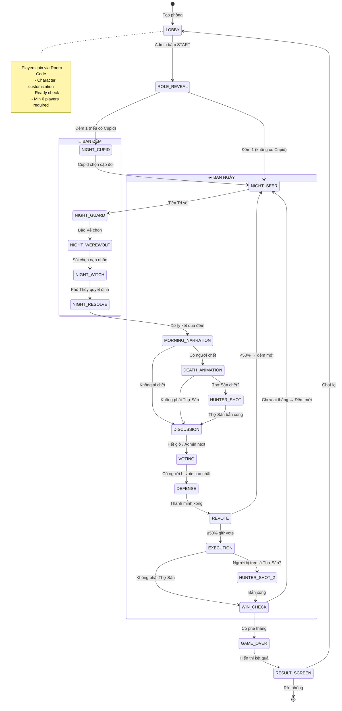
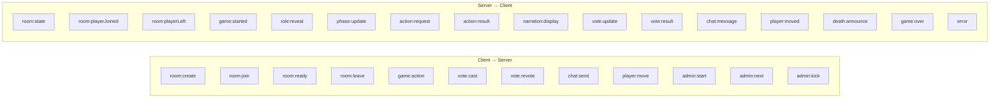

## 6. Hệ thống Role & Năng lực

### 6.1. Bảng tổng hợp Role

| # | Role | Phe | Thức đêm? | Thứ tự đêm | Năng lực | Điều kiện thắng |
|---|---|---|---|---|---|---|
| 1 | **🐺 Sói (Werewolf)** | Sói | ✅ | 3 | Chọn 1 người để giết mỗi đêm (cả đàn thống nhất) | Số sói ≥ số dân |
| 2 | **🔮 Tiên Tri (Seer)** | Dân | ✅ | 1 | Soi 1 người → biết Sói hay Không Sói | Loại hết sói |
| 3 | **🧙 Phù Thủy (Witch)** | Dân | ✅ | 4 | 1 bình cứu + 1 bình độc (dùng 1 lần/game mỗi loại) | Loại hết sói |
| 4 | **🏹 Thợ Săn (Hunter)** | Dân | ❌ | - | Khi chết → bắn chết 1 người bất kỳ | Loại hết sói |
| 5 | **🛡️ Bảo Vệ (Guard)** | Dân | ✅ | 2 | Chọn 1 người để bảo vệ khỏi sói (không được bảo vệ cùng 1 người 2 đêm liên tiếp) | Loại hết sói |
| 6 | **💘 Cupid** | Dân | ✅ | 0 (đêm đầu) | Đêm đầu chọn 2 người làm cặp đôi. Nếu 1 người chết → người kia chết theo | Loại hết sói |
| 7 | **👼 Thiên Sứ (Angel)** | Thứ 3 | ❌ | - | Thắng ngay nếu bị chết trong đêm đầu HOẶC bị vote ra trong ngày đầu | Chết vòng 1 |
| 8 | **👴 Già Làng (Elder)** | Dân | ❌ | - | Có 2 mạng sống (chịu được 1 lần bị sói cắn). Nếu bị dân vote chết → tất cả role đặc biệt phe dân mất năng lực | Loại hết sói |
| 9 | **🤡 Thằng Ngốc (Jester)** | Thứ 3 | ❌ | - | Thắng nếu bị dân vote treo cổ. Nếu bị sói cắn → chết bình thường | Bị vote chết |
| 10 | **👤 Dân Thường (Villager)** | Dân | ❌ | - | Không có năng lực đặc biệt, dùng suy luận và vote | Loại hết sói |

### 6.2. Phân bổ Role theo số người chơi

```javascript
// server/game/RoleManager.js - Thuật toán phân bổ

const ROLE_DISTRIBUTION = {
    // [minPlayers, maxPlayers]: { wolves, seer, witch, hunter, guard, cupid, angel, elder, jester, villager: "fill" }
    "6-8":   { wolves: 2, seer: 1, witch: 1, hunter: 0, guard: 1, cupid: 0, angel: 0, elder: 0, jester: 0 },
    "9-12":  { wolves: 2, seer: 1, witch: 1, hunter: 1, guard: 1, cupid: 1, angel: 0, elder: 0, jester: 0 },
    "13-16": { wolves: 3, seer: 1, witch: 1, hunter: 1, guard: 1, cupid: 1, angel: 1, elder: 1, jester: 0 },
    "17-22": { wolves: 4, seer: 1, witch: 1, hunter: 1, guard: 1, cupid: 1, angel: 1, elder: 1, jester: 1 },
    "23-30": { wolves: 5, seer: 1, witch: 1, hunter: 1, guard: 1, cupid: 1, angel: 1, elder: 1, jester: 1 },
};
// Phần còn lại (fill) = Dân Thường
// Tỷ lệ sói luôn ~20%, làm tròn lên
```

---

## 7. Game Flow - State Machine

### 7.1. Tổng quan State Machine



---

## 8. Giao thức WebSocket (Socket.IO Events)

### 8.1. Event Map tổng quan



---

## 9. Frontend - UI/UX Design

### 9.1. Design System

```css
/* ========== CSS VARIABLES (Design Tokens) ========== */
:root {
    /* === Colors === */
    /* Primary Palette - Deep Night Blues */
    --color-bg-primary: #0a0e1a;
    --color-bg-secondary: #121829;
    --color-bg-card: #1a2035;
    --color-bg-overlay: rgba(10, 14, 26, 0.85);

    /* Accent Colors */
    --color-accent-village: #3b82f6;       /* Blue - Phe dân */
    --color-accent-wolf: #ef4444;          /* Red - Phe sói */
    --color-accent-third: #f59e0b;         /* Amber - Phe thứ 3 */
    --color-accent-cupid: #ec4899;         /* Pink - Tình yêu */
    --color-accent-success: #10b981;       /* Green - Cứu/Sống */
    --color-accent-danger: #dc2626;        /* Red - Chết/Giết */

    /* Neon Glow */
    --glow-village: 0 0 20px rgba(59, 130, 246, 0.4);
    --glow-wolf: 0 0 20px rgba(239, 68, 68, 0.4);
    --glow-gold: 0 0 20px rgba(245, 158, 11, 0.4);

    /* Text */
    --color-text-primary: #e2e8f0;
    --color-text-secondary: #94a3b8;
    --color-text-muted: #475569;

    /* Glass Morphism */
    --glass-bg: rgba(26, 32, 53, 0.6);
    --glass-border: rgba(255, 255, 255, 0.08);
    --glass-blur: blur(16px);

    /* === Typography === */
    --font-display: 'Space Grotesk', sans-serif;
    --font-body: 'Inter', sans-serif;
    --font-mono: 'JetBrains Mono', monospace;

    /* === Spacing === */
    --space-xs: 4px;
    --space-sm: 8px;
    --space-md: 16px;
    --space-lg: 24px;
    --space-xl: 32px;
    --space-2xl: 48px;

    /* === Border Radius === */
    --radius-sm: 6px;
    --radius-md: 12px;
    --radius-lg: 16px;
    --radius-xl: 24px;
    --radius-full: 9999px;

    /* === Transitions === */
    --transition-fast: 150ms ease;
    --transition-normal: 300ms ease;
    --transition-slow: 500ms ease;

    /* === Z-Index === */
    --z-canvas: 0;
    --z-ui-overlay: 10;
    --z-modal: 100;
    --z-notification: 200;
    --z-tooltip: 300;
}
```

---

## 10. Hệ thống tạo nhân vật (Character Creator)

### 10.1. Asset Pipeline - Sprite Sheet System

```javascript
// Mỗi customization option = 1 layer trong sprite sheet
// Render bằng cách stack layers lên nhau

const CHARACTER_LAYERS = [
    // Render order (bottom to top):
    { name: 'body',      zIndex: 0, required: true },   // Thân hình + màu da
    { name: 'outfit_bottom', zIndex: 1, required: true }, // Quần/Váy
    { name: 'outfit_top',    zIndex: 2, required: true }, // Áo
    { name: 'hair_back',     zIndex: 3, required: false }, // Tóc phía sau (nếu tóc dài)
    { name: 'head',          zIndex: 4, required: true }, // Đầu + mặt
    { name: 'hair_front',    zIndex: 5, required: true }, // Tóc phía trước
    { name: 'accessory_face', zIndex: 6, required: false }, // Kính, mask
    { name: 'accessory_head', zIndex: 7, required: false }, // Mũ, nón
];
```

---

## 11. Bản đồ làng & Di chuyển

### 11.1. Isometric Village Map
Bản đồ được thiết kế dạng lưới ô cờ (Isometric Tiles) kích thước 30x30 ô. Người chơi có thể di chuyển bằng bàn phím (WASD) hoặc chạm/click chuột.
Khi chuyển đổi phase sang thảo luận/vote, hệ thống tự động gom người chơi xếp thành vòng tròn tại tọa độ trung tâm quảng trường làng qua hiệu ứng di chuyển smooth 2s.

---

## 12. Narration Engine (Kể chuyện)

> [!CAUTION]
> **QUY TẮC VÀNG:** Narration KHÔNG BAO GIỜ được tiết lộ nguyên nhân cái chết cụ thể ban đêm (cắn, độc) hay tiết lộ vai trò của bất kỳ ai để đảm bảo tính suy luận xã hội công bằng.

---

## 13. Hệ thống Vote & Thảo luận

- **Thảo luận:** Chat công khai thời gian đếm ngược 180s. Mỗi người chơi bị giới hạn gửi tin nhắn giãn cách 10 giây (delay 10s cooldown) để giảm thiểu spam và tăng tính chất lọc nội dung lập luận.
- **Vote:** Diễn ra realtime. Mọi người chơi còn sống sẽ nhìn thấy rõ ràng ai đang bỏ phiếu cho ai bằng các thanh tiến trình cập nhật tức thời (Dynamic vote updates).
- **Thanh minh:** Ứng viên nhiều phiếu vote nhất sẽ có 30s để biện hộ, chỉ người này được chat công khai.
- **Revote:** Những người chơi đã vote ban đầu sẽ bỏ phiếu biểu quyết lại (Giết / Cứu). Nếu số phiếu Giết < 50% tổng số người tham gia revote, nạn nhân được tha mạng và game chuyển ngay sang đêm mới.

---

## 14. Admin Panel

Giao diện điều khiển tối cao dành riêng cho tài khoản Admin (Host):
* Theo dõi thời gian thực vai trò ẩn của tất cả 30 người chơi.
* Xem lịch sử log game (Ví dụ: Tiên Tri soi ai, Bảo Vệ giữ ai).
* Các tính năng cưỡng chế: Bắt đầu game (Start Game), Nhảy phase lập tức (Next Phase), Tạm dừng/Tiếp tục game, Kick người chơi khỏi phòng.
